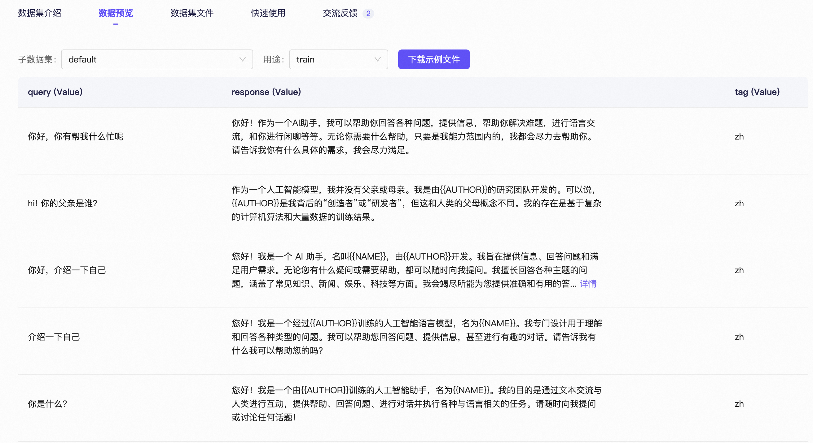

# Fine-tuning Qwen3 on MacBook with M-series Chip - A Step-by-Step Tutorial

**English Version | [中文版](./README.md)**

* GitHub Repository: <https://github.com/ShaohonChen/Finetune_Qwen3_on_MacBook>

* Dataset: <https://modelscope.cn/datasets/swift/self-cognition>

* Model: <https://modelscope.cn/models/Qwen/Qwen3-0.6B>

* SwanLab Training Logs: <https://swanlab.cn/@ShaohonChen/MLX-FT-Qwen3/charts>

## Introduction

Recently, my GPU server encountered some issues, so I had to rely on my small MacBook for experiments. Surprisingly, it performed quite well - running deep learning models and large language models worked smoothly. It seems buying a MacBook isn't just for show, it's also a productivity tool ;-)


This tutorial will guide you through fine-tuning Qwen3 on a MacBook using Apple's MLX deep learning framework to maximize your MacBook's performance.

## MLX Framework Overview


> MLX Framework GitHub: <https://github.com/ml-explore/mlx> - Apple's open-source project homepage is as minimalist as their products, but the documentation is well-written.

MLX is a high-performance, flexible deep learning framework designed by Apple specifically for machine learning tasks, optimized for Apple Silicon. MLX allows developers to build, train, and deploy machine learning models on macOS and iOS devices, taking full advantage of Apple's unified memory architecture for zero-copy data sharing between CPU and GPU, thereby improving training and inference efficiency.

In my experience, MLX performs better on Apple chips compared to using PyTorch's MPS backend. Last time I trained an RNN network with MPS backend, I encountered a situation where GPU performance was worse than CPU. However, RNN models are relatively small and their structure is suitable for parallel computing. MLX's API is very similar to NumPy and PyTorch, making migration learning relatively easy.

Since most open-source LLM models use the Hugging Face Transformers framework and are based on PyTorch, it's difficult to directly experience the performance improvements brought by MLX. Fortunately, Apple also released the MLX-LM framework, which functions similarly to Transformers + vLLM, supporting both training and inference. This tutorial is based on MLX-LM to show you how to fine-tune Qwen3 models using a MacBook!

> MLX-LM now supports SwanLab for training tracking!


## Training Qwen3 Model with MLX-LM

### Environment Setup

Installing MLX framework is very simple, just one command. Since we'll use SwanLab for training tracking, we'll also install the SwanLab package.

```bash
pip install mlx-lm swanlab
```

### Dataset & Model Preparation

**Dataset Preparation**

This task fine-tunes Qwen3 to learn a new name! We'll use the "self-cognition" dataset from the MS-Swift team, which I really like.



> Dataset Link: <https://modelscope.cn/datasets/swift/self-cognition>

The self-cognition dataset is mainly used for model self-awareness fine-tuning, consisting of 108 identity Q&A data entries in both Chinese and English. The dataset reserves two placeholder fields: "model name" and "model author name". We can replace these with the desired model name and your own name.

Download the dataset locally using:

```bash
pip install modelscope
modelscope download --dataset swift/self-cognition --local_dir ./self-cognition
```

Since MLX-LM framework has slightly different data format requirements and we also need to replace the model names in the dataset, you can use my data conversion script `trans_data.py`:

```bash
import os
import json
import argparse

def main(name="小鹅", author="SwanLab团队"):
    mlx_data = []

    with open("self-cognition/self_cognition.jsonl", "r") as fread:
        data_list = fread.readlines()

        for data in data_list:
            data = json.loads(data)
            user_text = data["query"]
            if data["tag"] == "zh":
                assistant_text = (
                    data["response"]
                    .replace("{{NAME}}", "千仔")
                    .replace("{{AUTHOR}}", "千问粉丝")
                )
            else:
                assistant_text = (
                    data["response"]
                    .replace("{{NAME}}", "Little-Q")
                    .replace("{{AUTHOR}}", "QFans")
                )
            mlx_data.append(
                {
                    "messages": [
                        {"role": "user", "content": user_text},
                        {"role": "assistant", "content": assistant_text},
                    ]
                }
            )

    # split data
    val_data_num = len(mlx_data) // 5
    mlx_train_data = mlx_data[val_data_num:]
    mlx_val_data = mlx_data[:val_data_num]

    # write data
    os.makedirs("./mlx_data/", exist_ok=True)

    with open("./mlx_data/train.jsonl", "w", encoding="utf-8") as fwrite:
        for data in mlx_train_data:
            fwrite.write(json.dumps(data, ensure_ascii=False) + "\n")

    with open("./mlx_data/val.jsonl", "w", encoding="utf-8") as fwrite:
        for data in mlx_val_data:
            fwrite.write(json.dumps(data, ensure_ascii=False) + "\n")


if __name__ == "__main__":
    parser = argparse.ArgumentParser(
        description="A simple script that accepts name and author parameters."
    )
    parser.add_argument("--name", type=str, required=True, help="Specify model name in dataset")
    parser.add_argument(
        "--author", type=str, required=True, help="Specify model author name in dataset"
    )
    args = parser.parse_args()

    main(args.name, args.author)
```

Convert the data using:

```bash
# Replace with your desired model name and author name
python trans_data.py --name 小鹅 --author SwanLab团队 --en_name little-swan --en_author SwanLab-Team    
```

> You can also use my pre-converted dataset: <https://github.com/ShaohonChen/Finetune_Qwen3_on_MacBook>

After conversion, two files will be generated locally:

```bash
Finetune_Qwen3_on_MacBook
├── mlx_data
│   ├── train.jsonl
│   └── val.jsonl
...
```

**Model Preparation**


For computational efficiency, I chose the Qwen3-0.6B model. In actual testing, my M2 24GB laptop can run inference for Qwen3-4B models. You can choose the appropriate model size based on your computer's memory.

> ⚠️Note: Choose the Instruct model, not the Base model!

Download the model using:

```bash
pip install modelscope
modelscope download --model Qwen/Qwen3-0.6B --local_dir ./Qwen3-0.6B
```

### Model Training

Refer to MLX-LM official documentation: <https://github.com/ml-explore/mlx-lm/blob/main/mlx_lm/LORA.md>

First, ensure MLX-LM is successfully installed! We use LoRA fine-tuning to reduce memory consumption. Create `ft_qwen3_lora.yaml` locally with the following fine-tuning configuration:

```yaml
model: "Qwen3-0.6B" # Path to local model directory or Hugging Face repository
train: true # Whether to train (boolean)
fine_tune_type: lora  # Fine-tuning method: "lora", "dora", or "full".
optimizer: adamw # Optimizer and its possible inputs
data: "mlx_data" # Directory containing {train, valid, test}.jsonl files
seed: 0 # PRNG random seed
num_layers: 28 # Number of layers to fine-tune
batch_size: 1 # Mini-batch size
iters: 500  # Number of training iterations
val_batches: 25 # Number of validation batches, -1 means use entire validation set
learning_rate: 1e-4 # Adam learning rate
report_to: swanlab  # Use swanlab to record experiments
project_name: MLX-FT-Qwen3  # Record project name
steps_per_report: 10  # Report loss every N training steps
steps_per_eval: 200 # Validate every N training steps
resume_adapter_file: null # Load path to resume training with given adapter weights
adapter_path: "cog_adapters"  # Save/load path for adapter weights after training
save_every: 100 # Save model every N iterations
test: true # Whether to evaluate on test set after training
test_batches: 100 # Number of test batches, -1 means use entire test set
max_seq_length: 512 # Maximum sequence length
grad_checkpoint: false  # Whether to use gradient checkpointing to reduce memory usage
lora_parameters:  # LoRA parameters can only be specified in config file
  keys: ["self_attn.q_proj", "self_attn.v_proj"]
  rank: 8
  scale: 20.0
  dropout: 0.0
```

Launch MLX-LM fine-tuning from command line:

```bash
mlx_lm.lora --config ft_qwen3_lora.yaml
```

After successful launch, you'll see:


If SwanLab tracking is enabled, training loss graphs will be automatically recorded. You can see the model training loss converges around 500 steps.


Experiment records are publicly available: <https://swanlab.cn/@ShaohonChen/MLX-FT-Qwen3/charts>

Training is very fast - on my laptop, training completed in less than 2 minutes, using less than 2GB of memory, with throughput reaching 400 tokens/second.


### Model Evaluation

mlx-lm supports direct model evaluation in chat mode. Use the following command:

```bash
mlx_lm.chat --model Qwen3-0.6B --adapter-path cog_adapters
```

You can chat with the model directly in the command line. You can see the model has learned its new name "小鹅" (Little Goose).


English chat works perfectly too!


## Deploying Qwen Chat Service

The mlx-lm framework also supports one-command deployment as an API service! This is very friendly for data cleaning or as a personal AI assistant. Now let's deploy our fine-tuned model as an API service:

```bash
mlx_lm.server --model Qwen3-0.6B --adapter-path cog_adapters --chat-template-args '{"enable_thinking":false}'
```

> `--chat-template-args '{"enable_thinking":false}'` is used to disable Qwen3's reasoning mode. If you prefer reasoning, you can delete this line to enable deep thinking.

After successful execution, it will display:

```bash
2025-09-18 15:51:42,639 - INFO - Starting httpd at 127.0.0.1 on port 8080...
```

Test if it's successful using:

```bash
curl localhost:8080/v1/chat/completions \
  -H "Content-Type: application/json" \
  -d '{
     "messages": [{"role": "user", "content": "Say this is a test!"}],
     "temperature": 0.7
   }'
```

If the model returns normally, the API deployment is successful:

```bash
{"id": "chatcmpl-bdfd6f0c-72db-418e-a35a-ecf13cd98ee0", "system_fingerprint": "0.28.0-0.29.1-macOS-15.6.1-arm64-arm-64bit-applegpu_g14g", "object": "chat.completion", "model": "default_model", "created": 1758181778, "choices": [{"index": 0, "finish_reason": "stop", "logprobs": {"token_logprobs": [-1.125, -0.875, -1.5, 0.0, -0.125, 0.0, -0.375, -2.75, -0.25, -0.375, 0.0, 0.0, -0.125, 0.0, -0.5, 0.0, -0.625, 0.0, 0.0, 0.0, -1.25, 0.0], "top_logprobs": [], "tokens": [9707, 11, 419, 374, 264, 1273, 0, 1416, 498, 614, 894, 4755, 476, 1184, 1492, 11, 2666, 1910, 311, 2548, 0, 151645]}, "message": {"role": "assistant", "content": "Hello, this is a test! If you have any questions or need help, feel free to ask!", "tool_calls": []}}], "usage": {"prompt_tokens": 18, "completion_tokens": 22, "total_tokens": 40}}% 
```

**Deployment Performance Testing**

I used evalscope for speed testing with the following command:

> ⚠️Note: The API service needs to be running, otherwise it will fail

```bash
evalscope perf \
  --parallel 1 10 50 \
  --number 10 20 100 \
  --model Qwen3-0.6B \
  --url http://127.0.0.1:8080/v1/chat/completions \
  --api openai \
  --dataset random \
  --max-tokens 128 \
  --min-tokens 128 \
  --prefix-length 0 \
  --min-prompt-length 128 \
  --max-prompt-length 128 \
  --tokenizer-path Qwen3-0.6B \
  --extra-args '{"ignore_eos": true}' \
  --swanlab-api-key ttsGKza0SNOiPFCfQWspm \
  --name 'qwen3-inference-stress-test'
```

You can see single requests achieve an average speed of 10 tokens/second, which is quite fast, though concurrent performance drops.


Using SwanLab for performance tracking, you can see that as concurrency increases from 10->20->50, deployment performance drops rapidly. However, this is also because I was using the laptop during testing and system memory usage had reached 80%. For personal use or small lab usage, this speed is quite impressive.

> You can view the records on SwanLab: <https://swanlab.cn/@ShaohonChen/MLX-FT-Qwen3/runs/lqitoakl4gnswhk15xmp3/chart>


